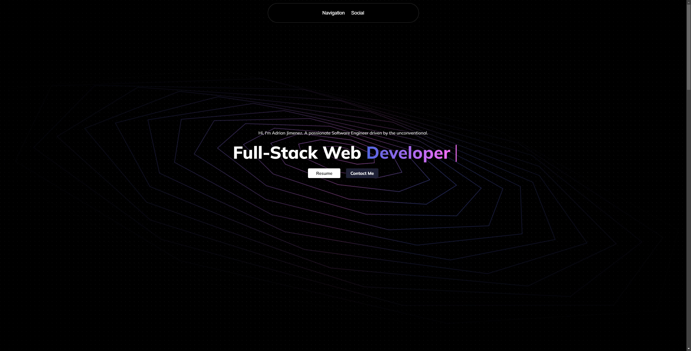

# Updated Portfolio for 2024

## Description

This is Adrian Jimenez's updated portfolio (currently not using any framework).

This project is a simple one page portfolio using HTML, CSS, and JavaScript. Inspiration for the design will be attributed in the credits section.

## Table of Contents

- [Installation](#installation)
- [Languages](#languages)
- [Usage](#usage)
- [Credits](#credits)
- [License](#license)
- [Contributing](#contributing)
- [Questions](#questions)

## Installation

In order to install this project, download all files and simply open index.html!

## Technologies Used

- JavaScript
- HTML
- CSS

## Usage

In order to use this project, please make sure you download all files into a directory. Once that is set up, open index.html. Alternatively, visit the site [here](https://puppetaj.github.io/Portfolio-2024/)

## Credits

- Adrian Jimenez
- [Spiral](https://codepen.io/hakimel/pen/QdWpRv?utm_source=extension&utm_medium=click&utm_campaign=muzli)

## License

This project is licensed under the MIT License. See [LICENSE.md](./LICENSE.md) for more details.

---

## Contributing

This project follows the contributor covenant contribution guidelines. See [here](https://www.contributor-covenant.org/version/2/1/code_of_conduct/)

## Questions

If you have any questions or concerns visit my [github](https://github.com/PuppetAJ) or send me an email at <adrianj.web@gmail.com>.
